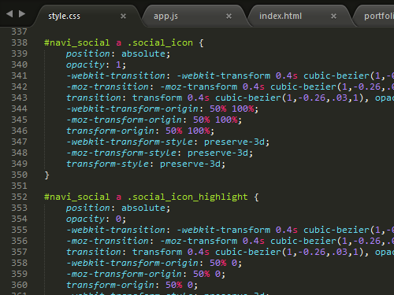

Personal Portfilio Page
===================
Check out the working page at **[DAVIDMELHART.COM](http://www.davidmelhart.com)**
Tags
-------------
HTML5, CSS3, JavaScript, jQuery, Knockout.js, web design, graphic design, interaction design
Project description
-------------
I wanted to do something new and fresh very quickly. I decided to use <strong>Knockout.js</strong> to build the site based on a simple view-model pattern.

I started with a quick sketch in <strong>Photoshop</strong> planning out the basic layout, and general ideas of the words, visual representation, and space. Though I did not plan the content ahead, due to the rapid development, I decided on an upbeat but straightforward language. I knew I wanted to convey playfulness but also reassure the viewer of my skills. To support this I went with a clean design with high contrast. First and foremost, I wanted my site to be easily accessible and readable. I set large font-sizes and decided on an ever-visible navigation bar with strong graphical indications where the user at on the site. But I wanted to keep my page whimsical, so I settled on a pixel-like typeface for the larger, easily readable headlines.

I wanted to keep the basic design of the page simple, so I went with flat aesthetics but I wanted to capitalise on space. The obvious solution was to add subtle, short 3D transformations to the navigation, reinforcing the pixely, blocky feeling of the page.

This, of course, determined the basic behaviour of the site. I made the modals slide in a similar manner and the whole page started to feel more tangible. However, I didn't want to go overboard, so I decided to keep the buttons simple, to gain some speed. The simple button design now used basic CSS to imitate as if they were pushed back into the page.

The general simplicity of the layout gives a clear structure that helps the user keep a lot of free cognitive resources for navigation. Buttons and interactive elements are clearly signified, and users can always keep track of their position on the site by looking at the navigation bar.

Bulk of the content was written after the page structure was done. Although this is usually unfortunate, I had clear ideas what kind of content I wanted and working as the only developer, I was able to move much quickly with the project. As mentioned above, I wanted to give a whimsical wink beyond giving a functional presentation of my professional work.

All in all, I am quite proud of the project and I hope you are enjoying my work and give it a good spin. <strong>;)</strong>

<i>Due to the rapidness of the project the site was tested on Chrome and Firefox only. If you encounter any issues, please feel free to contact me. I appreciate the feedback. </i>

